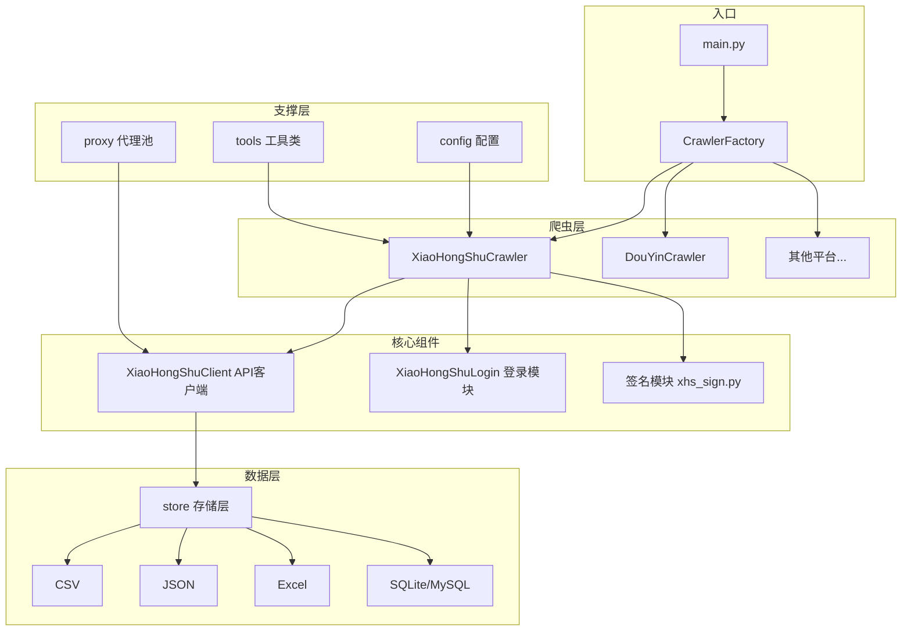

# MediaCrawler 项目梳理文档

## 📌 项目概述

MediaCrawler 是一个**多平台自媒体数据采集工具**，支持7个主流平台的公开数据抓取：

| 平台 | 代号 | 支持功能 |
|------|------|----------|
| 小红书 | `xhs` | 关键词搜索、帖子详情、创作者主页、评论爬取 |
| 抖音 | `dy` | 同上 |
| 快手 | `ks` | 同上 |
| B站 | `bili` | 同上 |
| 微博 | `wb` | 同上 |
| 贴吧 | `tieba` | 同上 |
| 知乎 | `zhihu` | 同上 |

---

## 🏗️ 架构设计

### 核心流程图



### 代码分层

| 层级 | 目录 | 职责 |
|------|------|------|
| **入口层** | `main.py` | 程序入口，命令行解析，爬虫工厂 |
| **配置层** | `config/` | 平台配置、数据库配置、代理配置 |
| **爬虫层** | `media_platform/` | 各平台爬虫核心实现 |
| **存储层** | `store/` | CSV/JSON/Excel/DB 多种存储支持 |
| **模型层** | `model/` | 数据结构定义（Pydantic） |
| **工具层** | `tools/` | CDP浏览器、滑块验证、工具函数 |
| **代理层** | `proxy/` | IP代理池管理 |
| **数据库层** | `database/` | ORM 模型与会话管理 |
| **基类层** | `base/` | 抽象基类定义 |

---

## 📁 核心目录详解

### 1. `media_platform/xhs/` - 小红书模块（以此为例）

| 文件 | 功能 |
|------|------|
| `core.py` | **爬虫核心**：`XiaoHongShuCrawler` 类，实现 search/detail/creator 三种爬取模式 |
| `client.py` | **API客户端**：封装小红书接口请求，处理签名 |
| `login.py` | **登录模块**：二维码登录、手机号登录、Cookie登录 |
| `xhs_sign.py` | **签名生成**：通过 JS 执行获取请求签名 |
| `help.py` | **辅助函数**：URL解析、搜索ID生成等 |
| `field.py` | **字段定义**：搜索排序类型等枚举 |

### 2. `config/` - 配置管理

| 文件 | 关键配置项 |
|------|-----------|
| `base_config.py` | `PLATFORM`（平台选择）、`KEYWORDS`（搜索关键词）、`CRAWLER_TYPE`（爬取模式）、`SAVE_DATA_OPTION`（存储方式）|
| `xhs_config.py` | 小红书专属配置：帖子ID列表、创作者链接等 |
| `db_config.py` | MySQL/SQLite 连接配置 |

### 3. `tools/` - 工具类

| 文件 | 功能 |
|------|------|
| `cdp_browser.py` | CDP浏览器管理器：使用用户真实浏览器，提供更好的反检测能力 |
| `browser_launcher.py` | 浏览器启动器 |
| `slider_util.py` | 滑块验证码处理 |
| `crawler_util.py` | 爬虫工具函数 |

---

## 🚀 快速上手

### 安装依赖
```bash
cd MediaCrawler
uv sync                    # 安装 Python 依赖
uv run playwright install  # 安装浏览器驱动
```

### 运行爬虫
```bash
# 关键词搜索（修改 config/base_config.py 中的 KEYWORDS）
uv run main.py --platform xhs --lt qrcode --type search

# 爬取指定帖子（需在 config/xhs_config.py 配置帖子ID）
uv run main.py --platform xhs --lt qrcode --type detail

# 爬取创作者主页
uv run main.py --platform xhs --lt qrcode --type creator
```

### 配置要点

核心配置文件：`config/base_config.py`

```python
PLATFORM = "xhs"                    # 目标平台
KEYWORDS = "编程副业,编程兼职"       # 搜索关键词
CRAWLER_TYPE = "search"             # 爬取类型：search/detail/creator
SAVE_DATA_OPTION = "json"           # 存储方式：csv/json/excel/db/sqlite
ENABLE_GET_COMMENTS = True          # 是否爬取评论
ENABLE_CDP_MODE = True              # 是否使用 CDP 模式（推荐）
```

---

## 📊 数据存储

数据保存在 `data/{platform}/{format}/` 目录下：

```
data/
├── xhs/
│   ├── json/
│   │   ├── search_contents_2025-12-11.json    # 帖子内容
│   │   └── search_comments_2025-12-11.json    # 评论数据
│   ├── csv/
│   └── excel/
└── ...
```

---

## 🔧 开发扩展

### 添加新平台

1. 在 `media_platform/` 下创建新目录
2. 实现 `AbstractCrawler` 基类（参考 `base/base_crawler.py`）
3. 实现核心方法：`start()`、`search()`、`launch_browser()`
4. 在 `main.py` 的 `CrawlerFactory.CRAWLERS` 中注册

### 抽象基类

```python
# base/base_crawler.py
class AbstractCrawler(ABC):
    async def start(self): ...      # 启动爬虫
    async def search(self): ...     # 关键词搜索
    async def launch_browser(self, ...): ...  # 启动浏览器

class AbstractLogin(ABC):
    async def login_by_qrcode(self): ...    # 二维码登录
    async def login_by_mobile(self): ...    # 手机号登录
    async def login_by_cookies(self): ...   # Cookie登录

class AbstractStore(ABC):
    async def store_content(self, content_item): ...  # 存储内容
    async def store_comment(self, comment_item): ...  # 存储评论
```

---

## 📚 相关文档

- [完整文档站点](https://nanmicoder.github.io/MediaCrawler/)
- [CDP模式使用指南](./CDP模式使用指南.md)
- [数据存储指南](./data_storage_guide.md)
- [Excel导出指南](./excel_export_guide.md)
- [常见问题](./常见问题.md)
